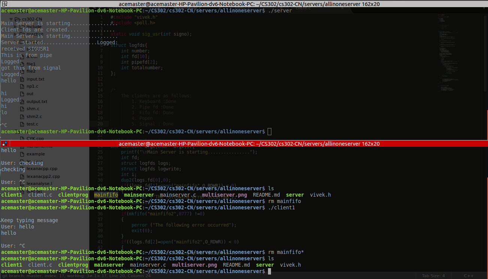

#All In One Server

Steps:

1. Compile the mainserver.c,server.c,client.c ``` gcc mainserver.c -o mainserver```
2. Comipile and Start client as ```gcc client.c -o clientprog; ./clientprog ``` 
3. Start server as the serve fifo name. ``` ./server```
4. This is a practice server utilizing different methods of communication


