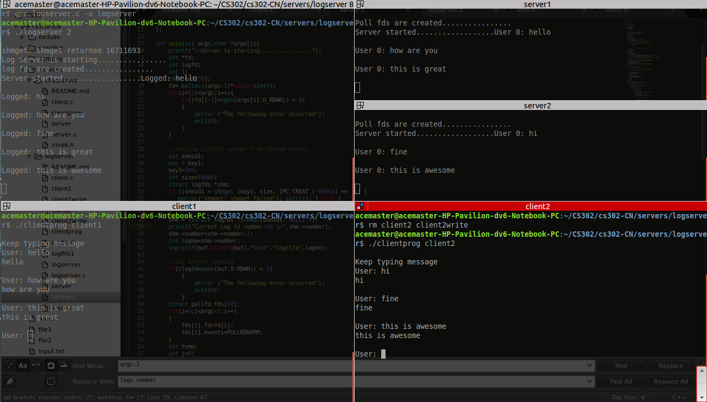

#Log Server

Steps:

1. Compile the logserver.c,server.c,client.c ``` gcc logserver.c -o logserver; gcc server.c -o server; gcc client.c -lpthread -o clientprog```
2. Depending on the number of servers connected to the logserver start logserver with that number ```./logserver i ``` Shared memory is used to automatically create the number of logfifos
3. Depending on the number of clients start a client as ```./clientprog client1 ``` 
4. Pass the clients to server ``` ./server client1 client2 ....... clienti ``` Shared memory is used to assign one of the logfifos to the serverprogram
5. Chat away


