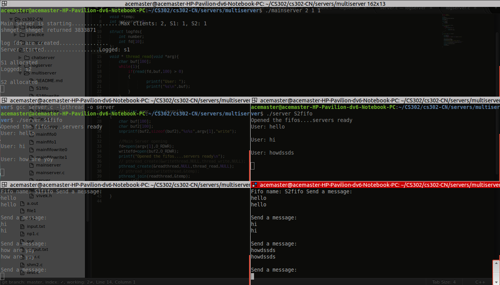

#Multi Server

Steps:

1. Compile the mainserver.c,server.c,client.c ``` gcc mainserver.c -o mainserver; gcc server.c -lpthread -o server; gcc client.c -lpthread -o clientprog```
2. Depending on the number of servers connected to the mainserver start logserver with that number ```./mainserver 2 1 1 ``` Shared memory is used to automatically create the number of logfifos. 2 for max clients, 1 for no. of s1 servers and the next 1 for the number of s2 servers (currently supported for 1 s1 or s2 -> 1 client model)
3. Start client as ```./clientprog ``` 
4. Start server as the serve fifo name. ``` ./server S1fifo ```
5. Chat away


