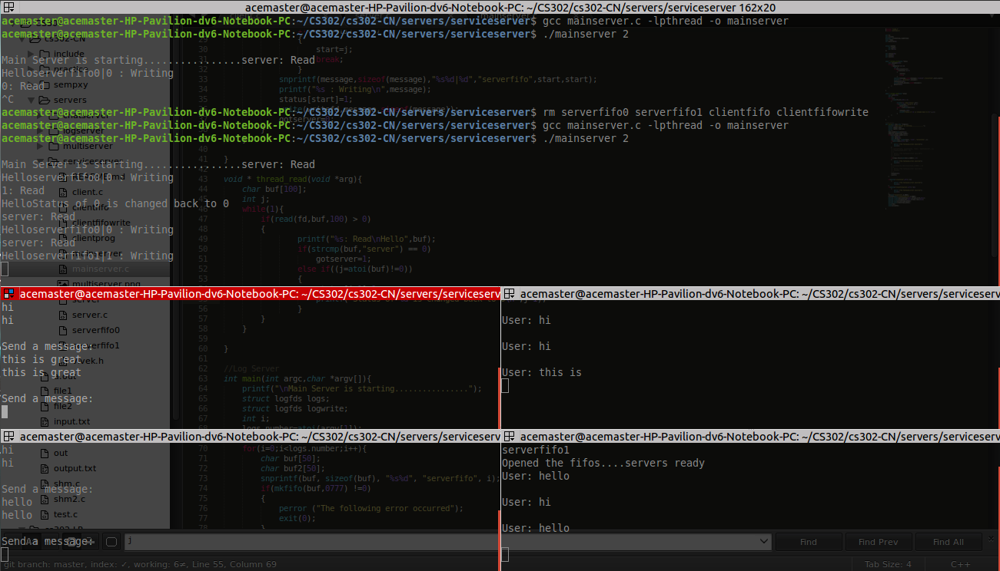

#Service Server

Steps:

1. Compile the mainserver.c,server.c,client.c ``` gcc mainserver.c -lpthread -o mainserver; gcc server.c -lpthread -o server; gcc client.c -lpthread -o clientprog```
2. Depending on the number of servers connected to the mainserver start service server with that number ```./mainserver 2 ``` 2 stands for the number of service servers with you. 
3. Start client as ```./clientprog ``` A server is automaticatically assigned 
4. Start server with server number ``` ./server 0 ```
5. Chat away


